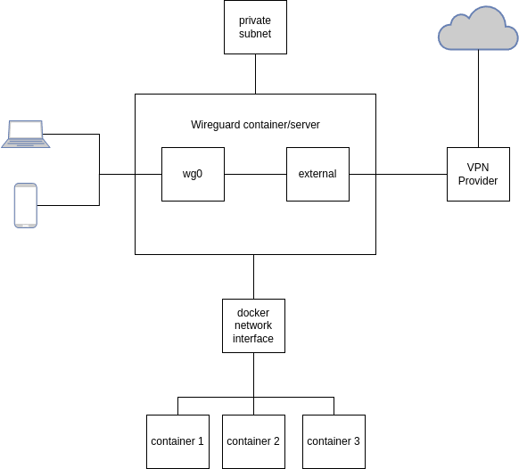

# Surfwire

Chain your Wireguard connections and manage them in a simple way with a Web ui and an Android app.

# Description

This project is intended for a server running a wireguard container with two interfaces: `wg0` and `external`.
The main use of such a setup is to use one Wireguard connection on your clients and split tunnel traffic based on your needs.
In the following explaination clients connect to `wg0` and traffic that is not directed to a specific private subnet or other
docker containers on the same host, is then routed to an external VPN provider. The VPN provider is in this case a commercial
VPN solution, which supports Wireguard, like Surfshark or Mullvad.

This is a simplified diagram:

# Details

## wg0

- `INTERNAL_VPN_ADDRESS`: IP address of the `wg0` interface. Can be chosed freely.
- `INTERNAL_VPN_PRIVATE_KEY`: Private key for `wg0`. Generated by you.
- `GATEWAY_IP`: IP address of the container's gateway.
- `CLIENT_PUBLIC_KEY`: Public key for your client.

## external

- `EXTERNAL_VPN_ADDRESS`: Wireguard IP address for the VPN service. This address is provided in their Wireguard config.
- `EXTERNAL_VPN_PRIVATE_KEY`: Wireguard private key for the VPN service. Also provided from your VPN service.
- `ROUTER_SUBNET`: A private subnet, which will be made accissable by your Wireguard clients.
- `GATEWAY_IP`: IP address of the container's gateway
- `EXTERNAL_VPN_PUBLIC_KEY`: Public key for your external VPN
- `EXTERNAL_VPN_ENDPOINT`: Endpoint address for the external VPN

## client

- `CLIENT_PRIVATE_KEY`: Private key for your clients. Generated by you.
- `CLIENT_INTERNAL_VPN_ADDRESS`: Address for your client on the `wg0` subnet. See `INTERNAL_VPN_ADDRESS` for reference.
- `CLIENT_DNS`: DNS server for your client. This is necessary, but it could be any server you want.
- `SURFWIRE_ENDPOINT`: Public IP of the Surfwire server.
